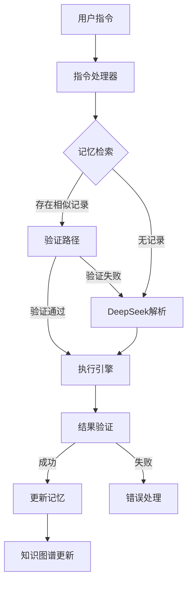

# Web自动化智能Agent技术方案文档

## 1. 项目概述

### 1.1 需求背景
实现一个智能Agent系统，能够通过自然语言指令自动执行Web页面操作。具体场景为：在页面A上有三个按钮（1、2、3），点击后分别跳转到对应的页面1、2、3，每个页面都有特定的文本内容。系统需要能够理解用户指令，执行正确的操作序列，并获取目标内容。

### 1.2 核心功能
- 自然语言指令解析
- 智能化页面操作
- 操作路径记忆与复用
- 异常处理和自动恢复
- 结果验证和反馈

### 1.3 技术栈选型
| 组件 | 技术选型 | 说明 |
|------|----------|------|
| 浏览器自动化 | Playwright | 主要的Web自动化工具 |
| 备用自动化 | PyAutoGUI | 处理特殊场景的备选方案 |
| 向量存储 | Qdrant | 高性能向量数据库，用于存储操作记忆 |
| 语义模型 | BGE Embeddings | 专为中文优化的语义向量模型 |
| 流程编排 | LangChain | 用于构建和管理操作链 |
| 图数据库 | Neo4j | 存储页面状态转换关系 |
| LLM服务 | DeepSeek API | 提供指令解析能力 |

## 2. 系统架构

### 2.1 整体架构


### 2.2 核心组件

#### 2.2.1 记忆系统 (Memory System)
使用Qdrant作为向量存储，结合BGE Embeddings进行语义检索：
```python
class EnhancedMemorySystem:
    def __init__(self):
        self.client = QdrantClient("localhost", port=6333)
        self.tokenizer = AutoTokenizer.from_pretrained("BAAI/bge-large-zh")
        self.model = AutoModel.from_pretrained("BAAI/bge-large-zh")
        
    def store_operation(self, instruction, actions):
        vector = self._get_embedding(instruction)
        self.client.upsert(
            collection_name="operations",
            points=[{
                "id": hash(instruction),
                "vector": vector.tolist(),
                "payload": {
                    "instruction": instruction,
                    "actions": actions
                }
            }]
        )
```

#### 2.2.2 执行引擎 (Execution Engine)
集成Playwright和PyAutoGUI的混合执行系统：
```python
class HybridExecutionEngine:
    def __init__(self):
        self.playwright = sync_playwright().start()
        self.browser = self.playwright.chromium.launch()
        self.page = self.browser.new_page()
        
    def execute_action(self, action):
        try:
            return self._playwright_execute(action)
        except Exception:
            return self._pyautogui_execute(action)
```

#### 2.2.3 知识图谱 (Knowledge Graph)
使用Neo4j存储页面状态转换关系：
```python
class StateGraph:
    def __init__(self):
        self.driver = GraphDatabase.driver(
            "bolt://localhost:7687",
            auth=("neo4j", "password")
        )
        
    def record_transition(self, from_state, action, to_state):
        with self.driver.session() as session:
            session.run("""
                MERGE (f:State {name: $from})
                MERGE (t:State {name: $to})
                MERGE (f)-[r:TRANSITION {action: $action}]->(t)
            """, from=from_state, to=to_state, action=action)
```

## 3. 核心流程

### 3.1 指令处理流程
1. 接收用户指令
2. 通过BGE生成指令的语义向量
3. 在Qdrant中检索相似操作
4. 如无匹配记录，调用DeepSeek API解析指令
5. 执行操作序列
6. 验证执行结果
7. 更新操作记忆

### 3.2 错误处理流程
1. 捕获执行异常
2. 切换到备用执行模式
3. 更新失败记录
4. 优化操作路径
5. 反馈执行状态

## 4. 部署方案

### 4.1 环境要求
- Python 3.8+
- Docker (可选，用于容器化部署)
- 8GB+ RAM
- 4+ CPU cores

### 4.2 依赖安装
```bash
pip install playwright langchain qdrant-client transformers torch neo4j pyautogui
playwright install chromium
```

### 4.3 配置说明
```python
# config.py
CONFIG = {
    "qdrant": {
        "host": "localhost",
        "port": 6333
    },
    "neo4j": {
        "uri": "bolt://localhost:7687",
        "user": "neo4j",
        "password": "password"
    },
    "deepseek": {
        "api_key": "your-api-key"
    }
}
```

## 5. 测试方案

### 5.1 单元测试
```python
def test_memory_system():
    memory = EnhancedMemorySystem()
    instruction = "点击按钮1并获取文本"
    actions = [{"type": "click", "target": "button1"}]
    
    # 测试存储
    memory.store_operation(instruction, actions)
    
    # 测试检索
    similar = memory.find_similar_operations(instruction)
    assert len(similar) > 0
```

### 5.2 集成测试
```python
def test_full_workflow():
    agent = WebAgent()
    result = agent.execute("点击按钮1并读取页面内容")
    assert "页面1的内容" in result
    
    # 测试记忆复用
    result2 = agent.execute("访问第一个页面")
    assert result2["source"] == "memory"
```

### 5.3 性能指标
| 指标 | 目标值 |
|------|--------|
| 指令响应时间 | <500ms |
| 记忆检索时间 | <100ms |
| 操作执行时间 | <2s |
| 记忆命中率 | >80% |

## 6. 扩展性考虑

### 6.1 横向扩展
- Qdrant支持集群部署
- Neo4j支持主从复制
- 可通过Docker Compose实现快速扩容

### 6.2 功能扩展
- 支持更复杂的页面操作
- 集成更多类型的验证机制
- 添加操作录制功能
- 支持多浏览器环境

## 7. 安全性考虑

### 7.1 数据安全
- 敏感信息加密存储
- 定期数据备份
- 访问权限控制

### 7.2 运行安全
- 操作超时控制
- 资源使用限制
- 异常操作拦截

## 8. 监控与维护

### 8.1 监控指标
- 系统资源使用率
- 操作成功率
- 记忆命中率
- API调用延迟

### 8.2 日志记录
```python
import logging

logging.basicConfig(
    level=logging.INFO,
    format='%(asctime)s - %(name)s - %(levelname)s - %(message)s',
    handlers=[
        logging.FileHandler('agent.log'),
        logging.StreamHandler()
    ]
)
```

## 9. 开发计划

### 9.1 第一阶段（1周）
- [x] 基础框架搭建
- [x] Qdrant集成
- [x] BGE模型集成
- [x] 基本Web操作实现

### 9.2 第二阶段（2周）
- [ ] 记忆系统完善
- [ ] 错误处理机制
- [ ] 知识图谱构建
- [ ] 测试用例编写

### 9.3 第三阶段（1周）
- [ ] 性能优化
- [ ] 监控系统
- [ ] 文档完善
- [ ] 部署方案

## 10. 示例代码

### 10.1 完整Agent实现
```python
class WebAgent:
    def __init__(self):
        self.memory = EnhancedMemorySystem()
        self.executor = HybridExecutionEngine()
        self.graph = StateGraph()
        
    async def execute(self, instruction):
        # 1. 检查记忆
        similar_ops = self.memory.find_similar_operations(instruction)
        
        if similar_ops:
            # 2. 尝试执行已知操作
            for op in similar_ops:
                try:
                    result = await self.executor.execute_actions(op["actions"])
                    return {"status": "success", "source": "memory", "result": result}
                except Exception as e:
                    continue
        
        # 3. 解析新指令
        actions = await self._parse_instruction(instruction)
        
        # 4. 执行操作
        try:
            result = await self.executor.execute_actions(actions)
            
            # 5. 记录成功操作
            self.memory.store_operation(instruction, actions)
            self.graph.record_transition(
                self.executor.current_state,
                actions,
                self.executor.current_state
            )
            
            return {"status": "success", "source": "new", "result": result}
            
        except Exception as e:
            return {"status": "error", "error": str(e)}
```

### 10.2 配置文件
```python
# settings.py
from pydantic import BaseSettings

class Settings(BaseSettings):
    QDRANT_HOST: str = "localhost"
    QDRANT_PORT: int = 6333
    NEO4J_URI: str = "bolt://localhost:7687"
    NEO4J_USER: str = "neo4j"
    NEO4J_PASSWORD: str = "password"
    DEEPSEEK_API_KEY: str = ""
    
    class Config:
        env_file = ".env"

settings = Settings()
```

## 11. 常见问题解决方案

### 11.1 元素定位失败
```python
def smart_locate(self, target):
    strategies = [
        self._locate_by_text,
        self._locate_by_id,
        self._locate_by_xpath,
        self._locate_by_vision
    ]
    
    for strategy in strategies:
        try:
            return strategy(target)
        except Exception:
            continue
            
    raise ElementNotFoundError(f"Cannot locate element: {target}")
```

### 11.2 页面加载超时
```python
async def wait_for_page_load(self):
    try:
        await self.page.wait_for_load_state("networkidle", timeout=5000)
    except TimeoutError:
        # 检查关键元素是否可用
        if await self._check_critical_elements():
            return True
        raise PageLoadError("Page load timeout")
```

## 12. 参考资源

- [Qdrant文档](https://qdrant.tech/documentation/)
- [BGE-Large-ZH模型](https://huggingface.co/BAAI/bge-large-zh)
- [Playwright Python API](https://playwright.dev/python/docs/intro)
- [LangChain文档](https://python.langchain.com/docs/get_started/introduction)
- [Neo4j Python Driver](https://neo4j.com/docs/python-manual/current/) 